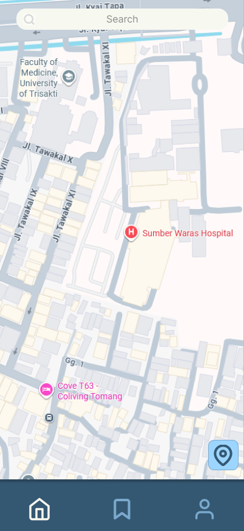
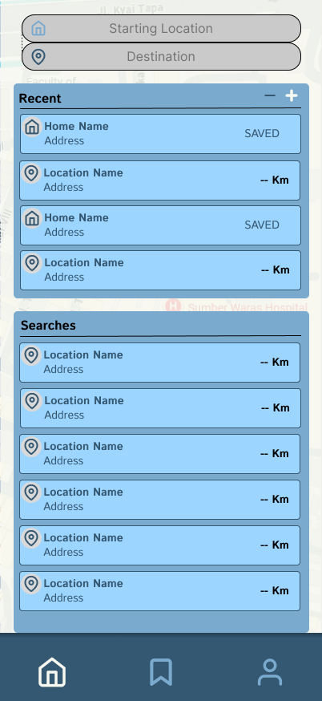

# ♿ RollEase


**An inclusive navigation companion that helps wheelchair users move through the city with confidence.**

RollEase is a mobile navigation app built to give wheelchair users safe, comfortable, and accessible routes. It is developed under the Program Kreativitas Mahasiswa - Karsa Cipta (PKM-KC) at Bina Nusantara University.

## 📝 Overview

Getting from one place to another is something most people never think twice about. For wheelchair users, a single curb without a ramp, an out-of-service lift, or an unexpectedly steep slope can turn a short trip into an impossible one. Conventional map apps are great at telling you *where* to go, but they rarely tell you *whether you can actually get there*.

RollEase was created to close that gap. It layers the micro-accessibility details that matter most, such as ramps, lifts, slope gradients, and physical obstacles, on top of everyday navigation, so the people who need that information can finally rely on it.

At its heart, RollEase pairs **Visual-Preview Path Mapping** with community-driven **crowdsourcing**. Users can preview real conditions at critical points along a route before they ever leave home, while a growing community of contributors keeps accessibility data fresh and trustworthy. Together, these ideas help RollEase:

- **Promote independence** by letting users plan and travel on their own terms.
- **Reduce risk** by surfacing inaccessible paths and obstacles early, before they become a problem.
- **Build an inclusive ecosystem** by inviting the public to map accessible facilities and share what they know.

This work is proudly supported by PKM-KC funding, which backs student-led innovation aimed at real social impact.

## ✨ Key Features

- **Accessible Routing:** A routing engine that prioritizes step-free, wheelchair-safe paths, accelerating accessible route discovery by 25%.
- **Visual-Preview Path Mapping:** A visual gallery of on-the-ground conditions at key points, so users can verify a route for themselves before setting out.
- **Community Crowdsourcing:** Lightweight reporting tools that let users flag obstacles and accessibility issues in real time, keeping the map accurate for everyone.

## 🛠️ Tech Stack

RollEase is built on the modern Node.js and TypeScript ecosystem, with design driven in Figma.

- **Framework:** [Expo](https://expo.dev/) + [React Native](https://reactnative.dev/)
- **Language:** [TypeScript](https://www.typescriptlang.org/) & JavaScript (Node.js ecosystem)
- **Design:** [Figma](https://www.figma.com/) high-fidelity prototypes
- **Mapping:** [OpenStreetMap](https://www.openstreetmap.org/) (OSM), an open and community-maintained map database
- **Spatial Data:** PostGIS for storing and processing spatial route data such as points, lines, and polygons

## 🎨 UI/UX Showcase

<table>
  <tr>
    <td align="center">
      <strong>Authentication / Register</strong><br/>
      
    </td>
    <td align="center">
      <strong>Home / Base Map</strong><br/>
      
    </td>
    <td align="center">
      <strong>Location Search</strong><br/>
      
    </td>
  </tr>
  <tr>
    <td align="center">
      <strong>Visual Preview</strong><br/>
      
    </td>
    <td align="center">
      <strong>Turn-by-Turn Navigation</strong><br/>
      
    </td>
    <td align="center">
      <strong>Active Accessible Route</strong><br/>
      
    </td>
  </tr>
</table>

*Note: UI/UX visualizations are exported directly from Figma high-fidelity prototypes as the application is currently undergoing build configuration updates.*

## 🚀 Getting Started

Make sure you have [Node.js](https://nodejs.org/) installed, then clone the repository and run:

```bash
# Install dependencies
npm install

# Start the Expo development server
npm start
```

From the Expo development server you can open the app on an Android device or emulator, or in Expo Go.

## 👥 Team (PKM-KC)

Developed by a student team at Bina Nusantara University:

- **Alvist Cruise** - Team Lead / Project Manager & UI/UX
- **Nicholas Wijaya** - UI/UX & Prototyping
- **Jevon Chang** - Social Media & Publication
- **Christian Kevin Farellius** - Data Collection & Documentation
- **Andrew Mardjohan** - Data Research & Reporting
- **Advisor:** Maulin Nasari, S.T., M.Kom.

---

*Built to help create an inclusive, disability-friendly Smart City ecosystem.*
